# Variational Autoencoders, Langevin Posterior Sampling, and Approximate EM

**Course:** CS5430 Machine Learning  
**Project:** Final Project — Diffusion/Sampling-Inspired Inference for VAEs  
**Author:** Joshua Ayelazuno  
**Dataset:** MNIST  
**Latent dimension:** 10  

---

## 1. Introduction

Latent-variable generative models introduce an unobserved variable \(z\) to explain the observed data \(x\). In a variational autoencoder (VAE), the generative model is defined by a prior distribution over latent variables and a conditional likelihood for the data:

\[
p(z) = \mathcal{N}(z;0,I),
\qquad
p_\theta(x|z).
\]

The decoder \(p_\theta(x|z)\) maps a low-dimensional latent vector \(z\) to a distribution over images. For this project, I used MNIST images and a latent dimension of 10. Since MNIST images are approximately binary after normalization to \([0,1]\), I modeled the decoder likelihood as a Bernoulli distribution over pixels:

\[
p_\theta(x|z)
=
\prod_{j=1}^{784}
\text{Bernoulli}(x_j;\sigma(a_j(z))),
\]

where \(a_j(z)\) is the decoder logit for pixel \(j\), and \(\sigma(\cdot)\) is the sigmoid function.

The central difficulty is that maximum likelihood training requires the marginal likelihood

\[
p_\theta(x)
=
\int p(z)p_\theta(x|z)\,dz,
\]

which is generally intractable for nonlinear neural-network decoders. Standard VAE training avoids this by introducing an approximate posterior \(q_\phi(z|x)\), deriving an evidence lower bound (ELBO), and optimizing this lower bound instead of the exact log-likelihood.

The goal of this project was to compare this standard VAE approach with an approximate expectation-maximization (EM) approach. Instead of relying only on the amortized approximate posterior \(q_\phi(z|x)\), the approximate EM method uses Langevin dynamics to sample from the true posterior \(p_\theta(z|x)\) up to an intractable normalizing constant. These posterior samples are then used to update the generator \(p_\theta(x|z)\).

---

## 2. VAE Objective

The marginal likelihood can be rewritten by introducing an arbitrary density \(q_\phi(z|x)\):

\[
\log p_\theta(x)
=
\log
\int
p_\theta(x,z)\,dz
=
\log
\int
\frac{p_\theta(x,z)}{q_\phi(z|x)}
q_\phi(z|x)\,dz.
\]

Applying Jensen's inequality gives the evidence lower bound:

\[
\log p_\theta(x)
\ge
\mathbb{E}_{q_\phi(z|x)}
\left[
\log
\frac{p_\theta(x,z)}{q_\phi(z|x)}
\right].
\]

Since

\[
p_\theta(x,z) = p(z)p_\theta(x|z),
\]

the ELBO becomes

\[
\mathcal{L}(\theta,\phi;x)
=
\mathbb{E}_{q_\phi(z|x)}
[
\log p_\theta(x|z)
]
-
D_{\mathrm{KL}}
\left(
q_\phi(z|x)
\Vert
p(z)
\right).
\]

Therefore, the negative ELBO minimized during training is

\[
-\mathcal{L}(\theta,\phi;x)
=
-\mathbb{E}_{q_\phi(z|x)}
[
\log p_\theta(x|z)
]
+
D_{\mathrm{KL}}
\left(
q_\phi(z|x)
\Vert
p(z)
\right).
\]

The first term is the reconstruction loss. The second term regularizes the approximate posterior toward the standard normal prior.

The encoder was parameterized as a diagonal Gaussian:

\[
q_\phi(z|x)
=
\mathcal{N}
\left(
z;
\mu_\phi(x),
\operatorname{diag}(\sigma_\phi^2(x))
\right).
\]

To backpropagate through samples from \(q_\phi(z|x)\), I used the reparameterization trick:

\[
z
=
\mu_\phi(x)
+
\sigma_\phi(x)\odot \epsilon,
\qquad
\epsilon \sim \mathcal{N}(0,I).
\]

For the MNIST Bernoulli likelihood, the negative log-likelihood term is binary cross entropy with logits:

\[
-\log p_\theta(x|z)
=
\sum_{j=1}^{784}
\text{BCEWithLogits}
(a_j(z),x_j).
\]

The VAE was trained for 20 epochs. The final validation metrics were:

| Metric | Value |
|---|---:|
| Validation negative ELBO | 109.197 |
| Validation reconstruction loss | 90.691 |
| Validation KL divergence | 18.506 |

The validation negative ELBO decreased smoothly from 131.008 to 109.197, indicating stable training.

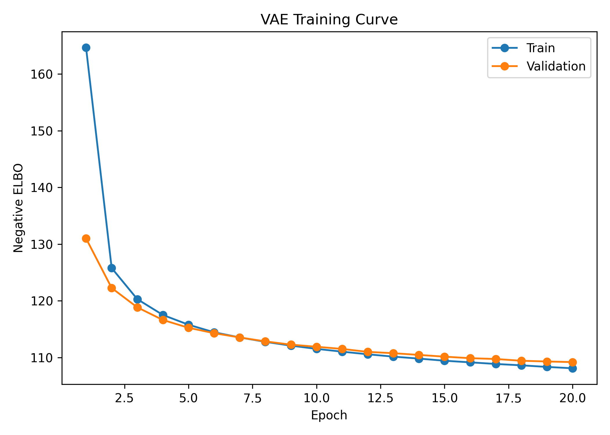

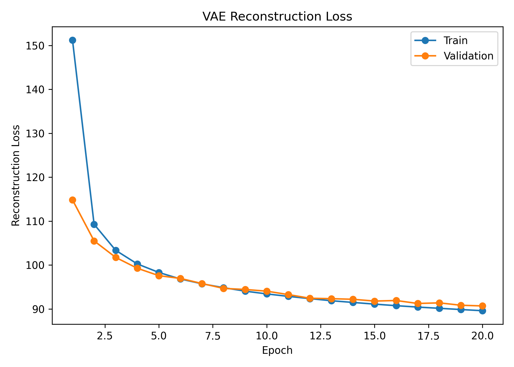

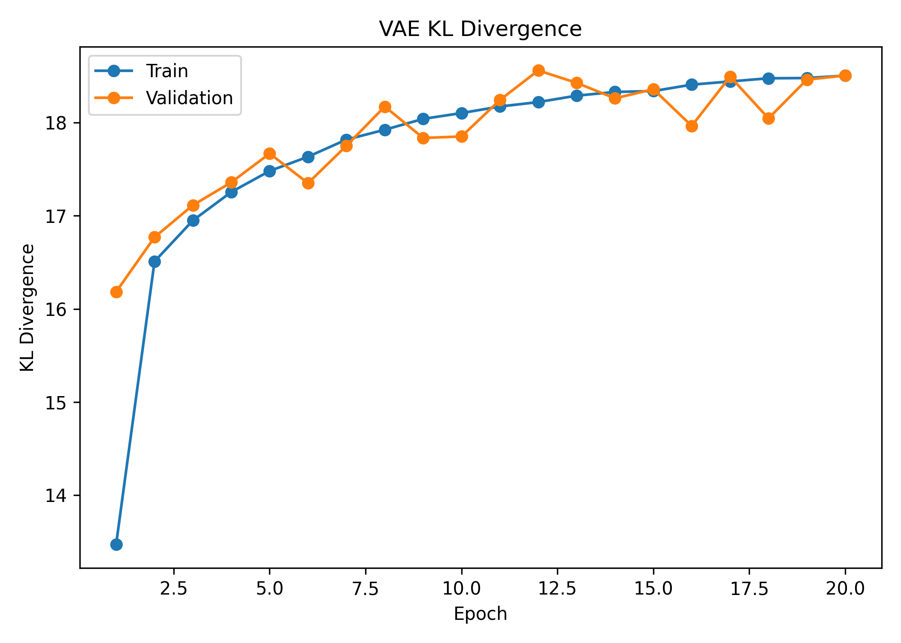

---

## 3. Posterior Gap and Motivation for Approximate EM

The VAE does not directly maximize the exact likelihood. The difference between the true log-likelihood and the ELBO is

\[
\log p_\theta(x)
-
\mathcal{L}(\theta,\phi;x)
=
D_{\mathrm{KL}}
\left(
q_\phi(z|x)
\Vert
p_\theta(z|x)
\right)
\ge 0.
\]

Thus, the ELBO is tight only when

\[
q_\phi(z|x) = p_\theta(z|x).
\]

In practice, \(q_\phi(z|x)\) is restricted to a simple family, such as diagonal Gaussians. The true posterior can be more complex, especially with nonlinear decoders. This motivates approximate EM: instead of using only \(q_\phi(z|x)\), we try to sample from the true posterior \(p_\theta(z|x)\) and use those samples to update the generative model.

The true posterior is

\[
p_\theta(z|x)
=
\frac{p(z)p_\theta(x|z)}{p_\theta(x)},
\]

where

\[
p_\theta(x)
=
\int p(z)p_\theta(x|z)\,dz.
\]

The denominator is intractable, but it does not depend on \(z\). Langevin sampling only requires the gradient of the log-density with respect to \(z\), so the intractable denominator disappears.

---

## 4. Langevin Sampler Derivation

The target posterior is

\[
p_\theta(z|x)
\propto
p(z)p_\theta(x|z).
\]

Taking the log gives the unnormalized posterior log-density:

\[
\log p_\theta(z|x)
=
\log p(z)
+
\log p_\theta(x|z)
-
\log p_\theta(x).
\]

Since \(\log p_\theta(x)\) is constant with respect to \(z\),

\[
\nabla_z \log p_\theta(z|x)
=
\nabla_z \log p(z)
+
\nabla_z \log p_\theta(x|z).
\]

For the standard normal prior,

\[
\log p(z)
=
-\frac{1}{2}z^\top z + C,
\]

so

\[
\nabla_z \log p(z) = -z.
\]

For the Bernoulli decoder,

\[
\log p_\theta(x|z)
=
\sum_{j=1}^{784}
\left[
x_j \log \sigma(a_j(z))
+
(1-x_j)\log(1-\sigma(a_j(z)))
\right].
\]

The gradient

\[
\nabla_z \log p_\theta(x|z)
\]

depends on the neural-network decoder, so I computed it using PyTorch automatic differentiation.

Using the unadjusted Langevin algorithm, the update is

\[
z^{(\tau+1)}
=
z^{(\tau)}
+
\eta
\nabla_z \log p_\theta(z^{(\tau)}|x)
+
\sqrt{2\eta}\epsilon^{(\tau)},
\]

where

\[
\epsilon^{(\tau)} \sim \mathcal{N}(0,I).
\]

The first term moves the sample toward higher posterior density. The second term injects Gaussian noise, allowing the chain to sample from the distribution rather than simply perform gradient ascent to a posterior mode.

In the implementation, I initialized the Langevin chain at the VAE encoder mean:

\[
z^{(0)} = \mu_\phi(x).
\]

This makes the sampler more efficient because the encoder mean is already near a region of high posterior density. The model parameters were temporarily frozen during the Langevin E-step because gradients were required with respect to \(z\), not with respect to \(\theta\).

A smoke test showed that reconstructions from Langevin posterior samples remained consistent with the original images and with reconstructions from the encoder mean.

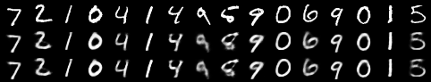

---

## 5. Approximate EM

The EM algorithm alternates between an E-step and an M-step. In an ideal latent-variable model, the E-step computes the posterior under the current parameters:

\[
p_{\theta^{old}}(z|x).
\]

The M-step maximizes the expected complete-data log-likelihood:

\[
Q(\theta,\theta^{old})
=
\mathbb{E}_{p_{\theta^{old}}(z|x)}
[
\log p_\theta(x,z)
].
\]

Since

\[
\log p_\theta(x,z)
=
\log p(z)
+
\log p_\theta(x|z),
\]

and \(\log p(z)\) does not depend on the decoder parameters, the M-step for the generator focuses on

\[
\mathbb{E}_{p_{\theta^{old}}(z|x)}
[
\log p_\theta(x|z)
].
\]

Because the exact posterior expectation is not available, I approximated it with Langevin samples:

\[
z^{(1)},\ldots,z^{(S)}
\sim
p_{\theta^{old}}(z|x).
\]

Then

\[
Q(\theta,\theta^{old})
\approx
\frac{1}{S}
\sum_{s=1}^{S}
\log p_\theta(x|z^{(s)}).
\]

The approximate M-step minimizes the negative version:

\[
-\frac{1}{S}
\sum_{s=1}^{S}
\log p_\theta(x|z^{(s)}).
\]

For the Bernoulli MNIST model, this is again binary cross entropy between the original image and the decoder logits.

The minibatch approximate EM algorithm used in this project was:

1. Load a minibatch of images \(x\).
2. Use the frozen VAE encoder to initialize \(z^{(0)}=\mu_\phi(x)\).
3. Run Langevin dynamics using the current decoder to sample from \(p_{\theta^{old}}(z|x)\).
4. Detach the sampled latent variables from the computation graph.
5. Perform one or more gradient steps on the decoder using the sampled \(z\)'s.
6. Repeat for each minibatch.

The encoder was frozen during approximate EM. It was retained only as a practical initialization for Langevin chains. The generator/decoder was the part of the model updated in the approximate M-step.

The EM configuration used for the final comparison was:

| Parameter | Value |
|---|---:|
| EM epochs | 5 |
| Maximum training minibatches per epoch | 200 |
| Batch size | 128 |
| Langevin steps | 50 |
| Burn-in steps | 20 |
| Posterior samples per image | 1 |
| M-step updates per minibatch | 1 |
| EM learning rate | 0.0005 |

The approximate EM training metrics were stable:

| Epoch | Train M-step NLL | Validation encoder-mean reconstruction loss |
|---:|---:|---:|
| 1 | 85.971 | 85.083 |
| 2 | 85.458 | 85.018 |
| 3 | 85.293 | 84.926 |
| 4 | 85.062 | 84.918 |
| 5 | 85.230 | 84.845 |

The validation diagnostic improved from 85.083 to 84.845. The M-step NLL also remained stable, with a small increase at the final epoch. This is not surprising because the training is stochastic: each minibatch uses approximate Langevin samples rather than an exact E-step.

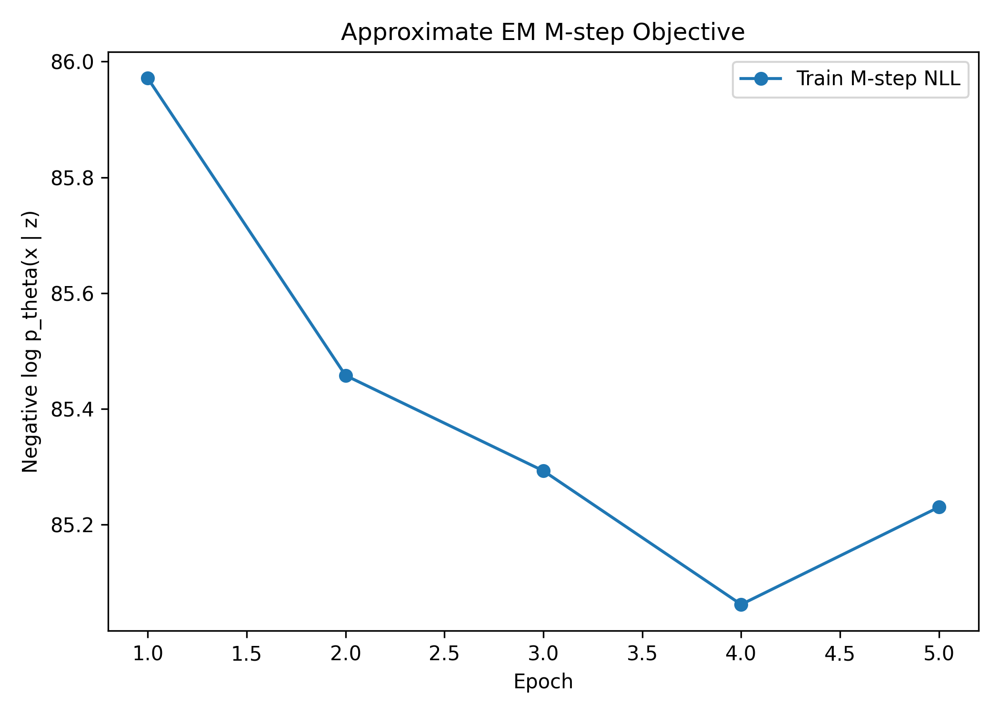

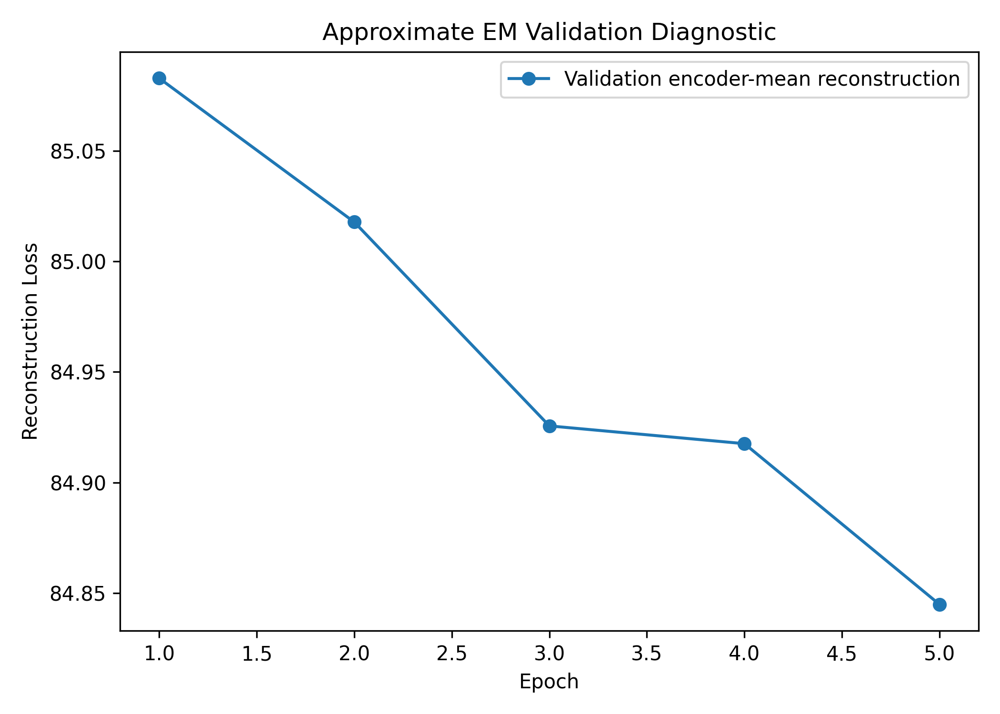

---

## 6. Evaluation Metrics

I compared the baseline VAE and the approximate EM-trained model using three main criteria.

### 6.1 Encoder-Mean Reconstruction Loss

For both models, I computed deterministic reconstructions using

\[
z = \mu_\phi(x).
\]

Then I measured the Bernoulli negative log-likelihood of the image under the decoder:

\[
-\log p_\theta(x|\mu_\phi(x)).
\]

This gives a fair deterministic reconstruction diagnostic, although it is not the full VAE objective.

### 6.2 Approximate Test Log-Likelihood

The marginal likelihood is

\[
p_\theta(x)
=
\int p(z)p_\theta(x|z)\,dz.
\]

I approximated this integral by importance sampling using the encoder as the proposal distribution:

\[
q_\phi(z|x).
\]

Using samples

\[
z^{(s)} \sim q_\phi(z|x),
\]

the estimate is

\[
p_\theta(x)
\approx
\frac{1}{S}
\sum_{s=1}^{S}
\frac{
p(z^{(s)})p_\theta(x|z^{(s)})
}{
q_\phi(z^{(s)}|x)
}.
\]

In log-space,

\[
\log p_\theta(x)
\approx
\log
\left[
\frac{1}{S}
\sum_{s=1}^{S}
\exp
\left(
\log p_\theta(x|z^{(s)})
+
\log p(z^{(s)})
-
\log q_\phi(z^{(s)}|x)
\right)
\right].
\]

For the final comparison, I used 500 importance samples per image and evaluated all 10,000 MNIST test images.

### 6.3 Latent Representation Visualization

I also visualized latent representations using t-SNE. For the VAE, I used encoder means \(\mu_\phi(x)\). For the EM-trained model, I visualized both the encoder-mean initialization and one Langevin posterior sample per image.

---

## 7. Results

### 7.1 Reconstructions and Prior Samples

The VAE reconstructions are digit-like and remain close to the original MNIST images.

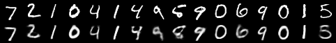

The approximate EM reconstructions are also digit-like and visually similar to the original images.

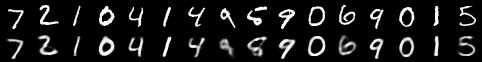

Samples from the prior were generated by drawing

\[
z \sim \mathcal{N}(0,I)
\]

and decoding through \(p_\theta(x|z)\).

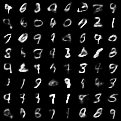

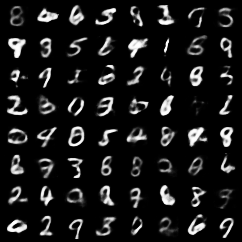

The EM prior samples remained digit-like, although the visual difference from the VAE samples was not dramatic. This is expected because EM was initialized from a trained VAE and then run for a moderate number of updates.

### 7.2 Quantitative Comparison

The final test comparison used all 10,000 MNIST test examples and 500 importance samples per image.

| Model | Encoder-mean reconstruction loss | Approx. mean test log-likelihood | Std. across test images |
|---|---:|---:|---:|
| VAE | 84.612 | -104.602 | 29.797 |
| Approximate EM | 83.625 | -103.890 | 29.694 |

The approximate EM model improved the encoder-mean reconstruction loss by

\[
84.612 - 83.625 = 0.987
\]

nats per image.

It also improved the approximate mean test log-likelihood by

\[
-103.890 - (-104.602) = 0.713
\]

nats per image.

Because larger log-likelihood is better, the less negative value for the approximate EM model indicates a modest improvement.

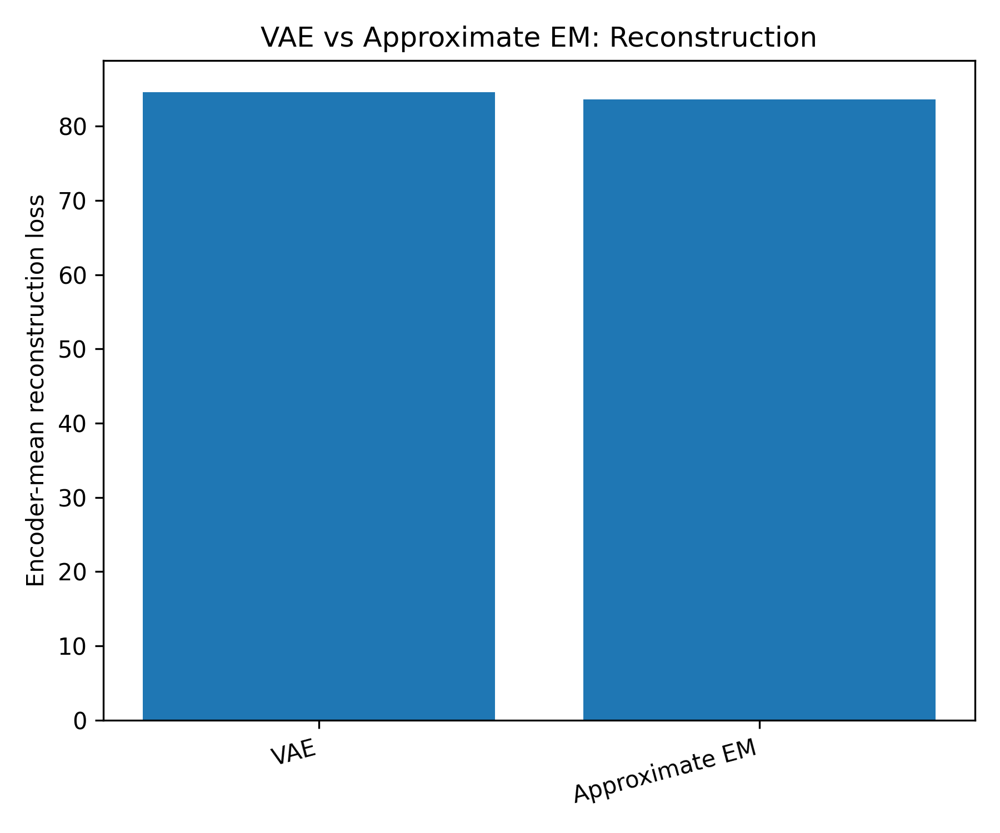

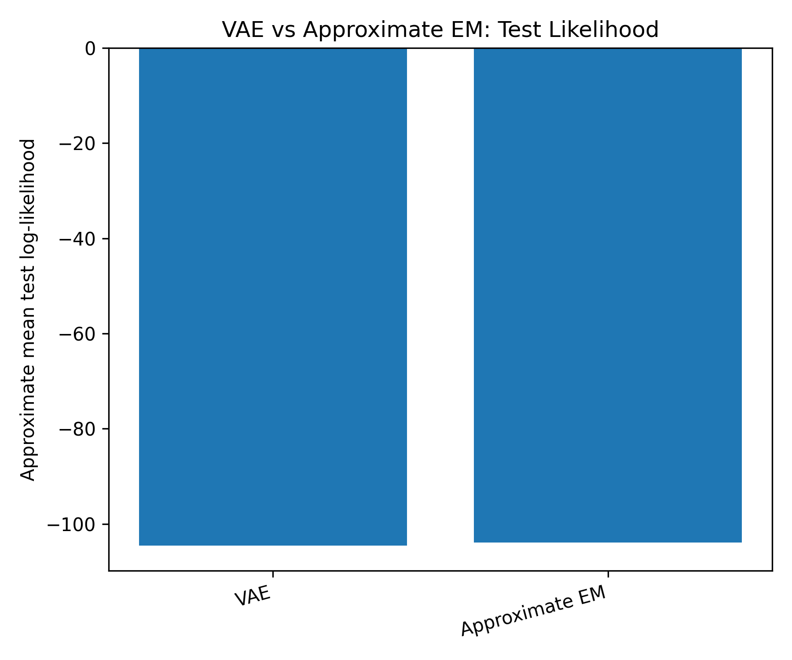

### 7.3 Latent t-SNE Visualizations

The VAE encoder means show class-dependent structure in the latent space.

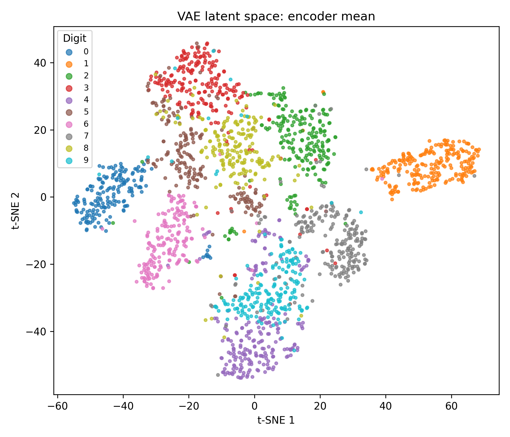

The EM model using encoder means gives a comparable latent organization because the encoder was initialized from the VAE and frozen during EM.

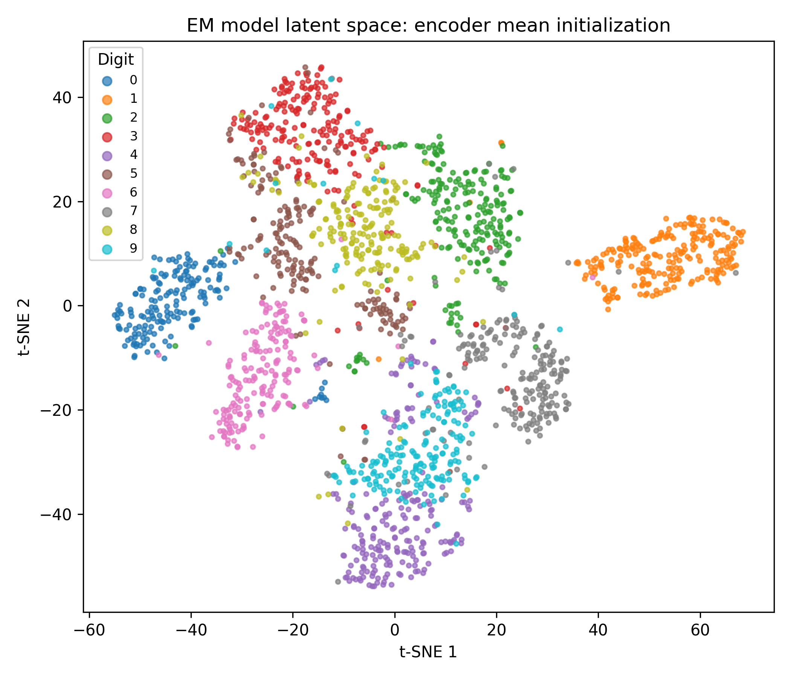

The EM Langevin posterior samples also retain digit-dependent structure, but they reflect posterior samples after local refinement under the decoder.

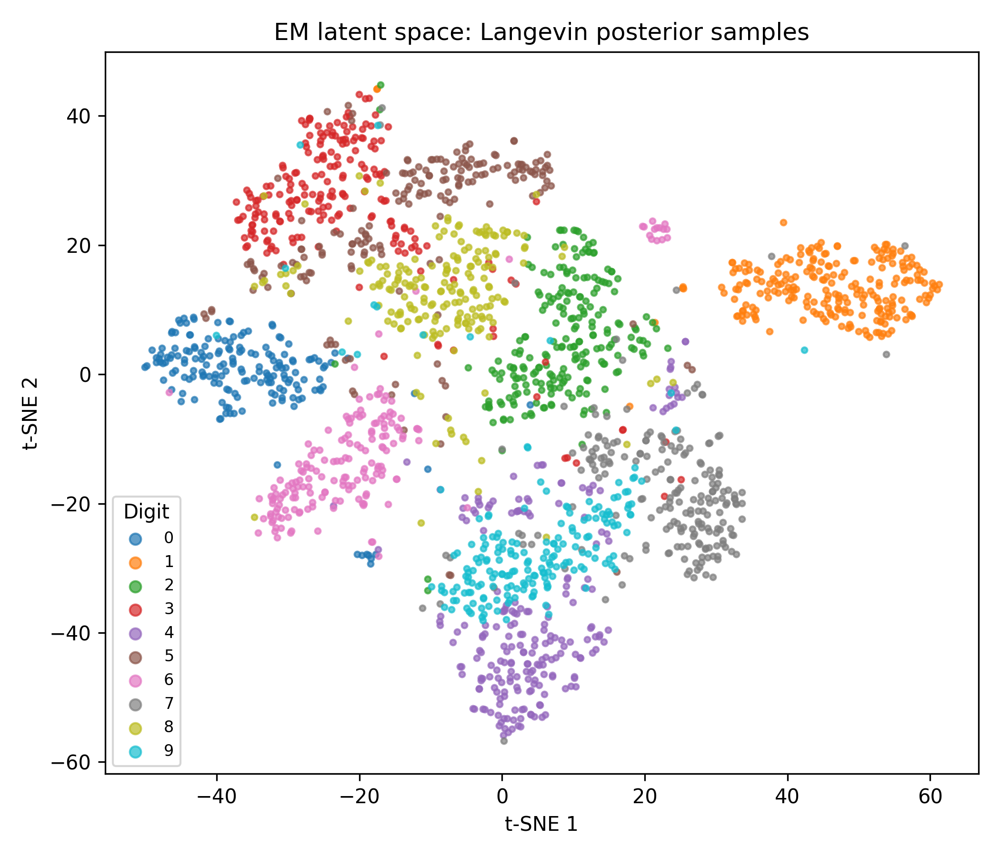

---

## 8. Discussion

The results show that approximate EM slightly improved the VAE-initialized generator. The reconstruction loss decreased from 84.612 to 83.625 nats per image, and the approximate mean test log-likelihood improved from -104.602 to -103.890 nats per image.

This supports the main idea of the project. The VAE relies on an amortized approximate posterior \(q_\phi(z|x)\). If this approximate posterior differs from the true posterior \(p_\theta(z|x)\), then the ELBO is not equal to the true log-likelihood. Approximate EM attempts to reduce this limitation by using Langevin dynamics to sample from the true posterior, up to the unknown normalizing constant.

The improvement was modest, not dramatic. There are several reasons for this. First, the approximate EM model was initialized from a well-trained VAE, so the baseline was already strong. Second, the EM run was intentionally moderate because Langevin sampling is computationally expensive. Third, only one posterior sample per image was used in the M-step. More posterior samples, more Langevin steps, or more M-step updates might improve the result, but would increase runtime.

An important distinction is that VAE training jointly learns both the encoder and decoder, while my approximate EM procedure froze the encoder and updated only the decoder. The encoder was used only to initialize the Langevin chain. Therefore, the EM model can improve the generator without improving the amortized encoder itself.

Another important point is that better posterior-sample reconstruction does not automatically guarantee better prior samples. The VAE objective explicitly regularizes \(q_\phi(z|x)\) toward the prior \(p(z)\), which helps make random prior samples decode into meaningful images. Approximate EM updates the decoder using posterior samples and does not directly train an encoder to match the prior. In this experiment, prior samples remained reasonable, likely because EM started from a trained VAE and used only moderate updates.

---

## 9. Limitations and Future Work

This project used MNIST and a simple multilayer perceptron VAE. MNIST is useful for debugging and for clear interpretation, but it is much simpler than natural image datasets such as CIFAR. A convolutional VAE would likely perform better on image data.

The Langevin sampler used here was the unadjusted Langevin algorithm. It does not include a Metropolis-Hastings correction step, so it introduces discretization bias. Smaller step sizes can reduce this bias but require more sampling steps.

The approximate EM run used one posterior sample per image and one M-step update per minibatch. A larger experiment could explore:

1. more posterior samples per image,
2. more Langevin steps,
3. different Langevin step sizes,
4. multiple M-step updates per minibatch,
5. persistent chains rather than reinitializing from the encoder mean,
6. convolutional encoder and decoder architectures,
7. CIFAR experiments.

Finally, the approximate likelihood estimates are importance-sampling estimates using the encoder as the proposal distribution. These are useful for model comparison, but they are still approximations to the true marginal likelihood.

---

## 10. Reproducibility

The main pipeline can be reproduced with:

./scripts/run_main_results.sh

python main.py --config configs/mnist_latent10.yaml --mode train_vae
python scripts/plot_vae_training_history.py

python main.py --config configs/mnist_em_medium.yaml --mode train_em
python scripts/plot_em_training_history.py

python scripts/compare_vae_em.py \
  --config configs/mnist_em_medium.yaml \
  --likelihood_samples 500 \
  --max_test_batches 80 \
  --tsne_points 2000

The implementation files are organized as follows:

python scripts/plot_vae_em_metrics.py

| Component               | File                           |
| ----------------------- | ------------------------------ |
| VAE model               | `src/models/vae.py`            |
| VAE loss                | `src/training/vae_loss.py`     |
| VAE training loop       | `src/training/train_vae.py`    |
| Langevin sampler        | `src/sampling/langevin.py`     |
| Approximate EM training | `src/training/train_em.py`     |
| Evaluation metrics      | `src/evaluation/metrics.py`    |
| Latent visualization    | `src/evaluation/latent_viz.py` |
| Main driver             | `main.py`                      |
| Full pipeline script    | `scripts/run_main_results.sh`  |

11. Conclusion

This project implemented and compared two approaches to training a latent-variable generative model on MNIST. The baseline VAE optimized the ELBO using an amortized diagonal-Gaussian approximate posterior. The approximate EM method initialized from the VAE, used Langevin dynamics to sample from the true posterior pθ(z∣x), and updated the decoder using minibatch approximate M-steps.

The approximate EM model modestly improved both reconstruction loss and approximate test log-likelihood. This suggests that posterior sampling with Langevin dynamics can refine a VAE-trained generator by moving beyond the amortized posterior used in the ELBO. The gains were not large, but they were consistent with the theory and were obtained with a moderate computational budget.

References

[1] Diederik P. Kingma and Max Welling. An Introduction to Variational Autoencoders. Foundations and Trends in Machine Learning, 2019.

[2] Radford M. Neal. MCMC using Hamiltonian dynamics, 2012.

